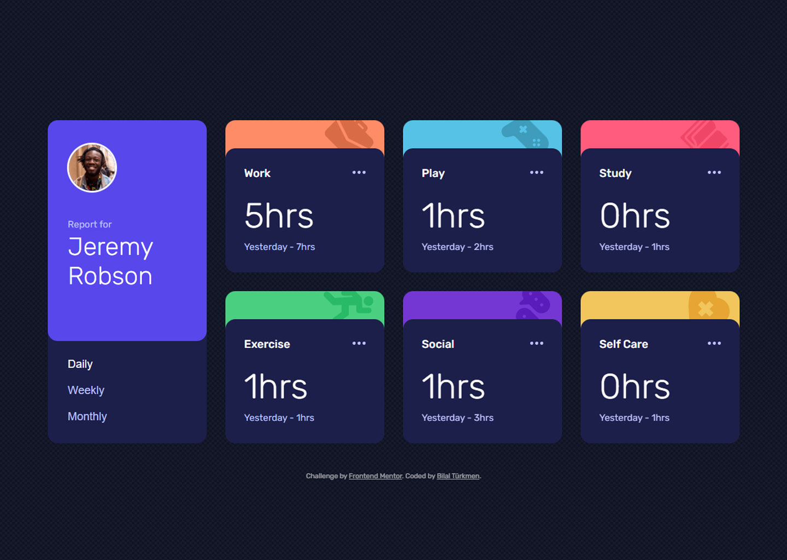

<h1>Time tracking dashboard</h1>

  <h3>
    <a href="https://splendid-sopapillas-57ee77.netlify.app/"> Live View </a>
     | 
    <a href="https://www.frontendmentor.io/solutions/time-tracking-dashboard-with-react-ts-njkwXa4usV"> Solution Page </a>
  </h3>

  A challenge on Frontend Mentor.

## 👍 My Challenges:

- Custom components created.
- I tried show data by period and change card color by category.
- and worked for the good user experience.
- Getting high rate from [PageSpeed Insights](https://pagespeed.web.dev/analysis/https-splendid-sopapillas-57ee77-netlify-app/dy4oseb2cc?form_factor=mobile)

## 🎉 Build With:

- React + TypeScript
- Semantic HTML5 markup
- Css Grid
- Mobile-first workflow
- CSS custom properties
