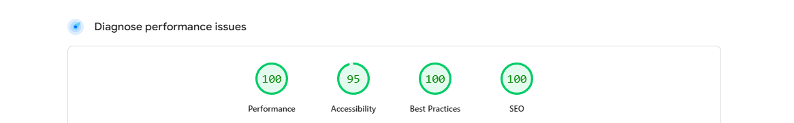

<h1>Time tracking dashboard</h1>

  <h3>
    <a href="https://ttdashboardx.netlify.app/"> Live View </a>
     | 
    <a href="https://www.frontendmentor.io/solutions/time-tracking-dashboard-with-react-ts-njkwXa4usV"> Solution Page </a>
  </h3>

  A challenge on Frontend Mentor.

## 👍 My Challenges:

- Custom components created.
- I tried displaying the data by time period and changing the card color by category.
- And efforts were made to provide a good user experience.

- High score received from [PageSpeed Insights](https://pagespeed.web.dev/analysis/https-ttdashboardx-netlify-app/on3z9j4xr0?form_factor=mobile)
  

## 🎉 Build With:

- React JS + TypeScript
- Semantic HTML markup
- Grid CSS
- Mobile-first workflow
- CSS custom properties
